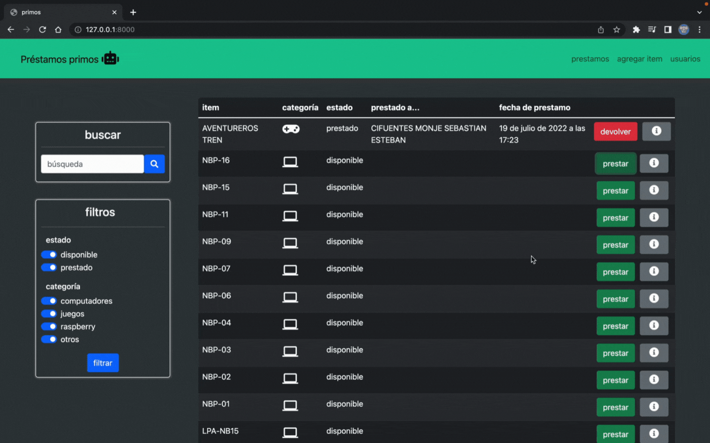
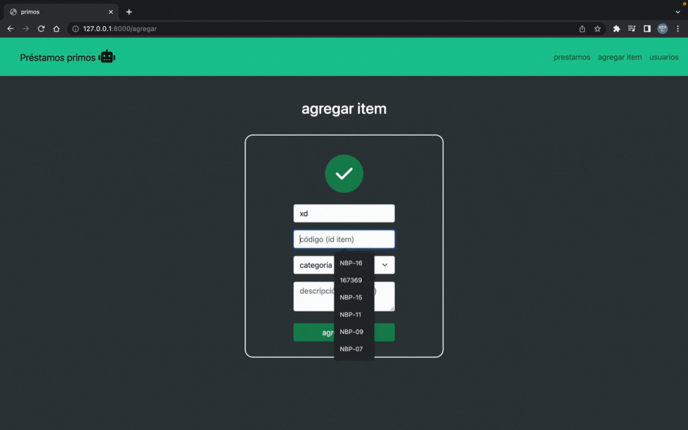

# Sistema de préstamos

##### Sistema de préstamos programado en python, de tipo biblioteca que permite la gestión de distintos items, permitiendo registrar la hora de préstamo, hora en la que se devolvió, y los datos del usuario al que fue prestado.



##### El sistema permite agregar tantos items como sea necesario.



---

### Instrucciones de ejecución

---

para ejecutar, primero hayque crear el entorno virtual con:

```
python3 -m venv .venv
```

```
source .venv/bin/activate
```

instala las dependencias

```
pip3 install -r requirements.txt
```

hace las migraciones

```
python3 manage.py migrate
```

correr la app

```
python3 manage.py runserver
```

---

si todo sale bien, la app debería correr en [http://localhost:8000]()

si modificas las clases, debes primero crear las migraciones con:

```
python3 manage.py makemigrations
```

---
